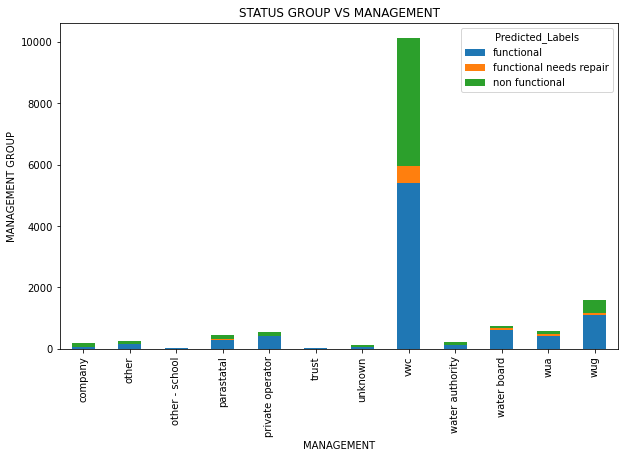

# Predicting Functional Status Of Water Wells In Tanzania

**Author**: Joan Njoroge

## Repository Structure
>
- README.md: The top level README for reviewers of this project
- Final workbook.ipynb: narritive documentation of analysis in jupyter notebook
- TANZANIA WATER WELLS PREDICTIONS.pdf: pdf version of project presentation slides
## Business problem
>

This study aims to forecast the functional condition of Tanzanian water wells using machine learning classification algorithms. Functional, non-functional, and functional but in need of repair are the several status groups for classification. The idea is to increase access to water throughout Tanzania by forecasting a well's operational state.

## Data
>
The data used for this project is from the Data Driven website. The link to the website to obtain the data for yourself is: <https://www.drivendata.org/competitions/7/pump-it-up-data-mining-the-water-table/page/23/>

## Approach
>
The approach for this project was to create many different model types to see which model performs the best, and to compare and contrast the different types of models.

First data was prepared through filling missing values and dropping features that did not seem useful to the analysis. EDA was also carried to to have an idea of how the data was distributed. Scaling using standard scaler and encoding was done with the goal of increasing accuracy of the models.

 

## Methods
>
To account for the class imbalance, SMOTE was used to oversample the "needs repair" and "nonfunctional" classes.
>
Different models were used , each performing differently from the other one. The best performing model was the ensambled model.

> Confusion matrix results of the Voting classifier

## Model interpratation comparing it to random forest classifier which was previously my best performing model
>
**Model 7** created through ensabling is the best performing model out of our 8 models with an accuracy of 80 and an roc of 0.91.

#### CHALLANGES FACED DURING MODELLING
>

> *1. Class Imbalances*

Challanges faced during modelling were class imbalances which have greatly affected the scores of the functional needs repair class as observerd
> 
> *2. Missing Information*

Missing information which made the cleaning process very t Principal Component Analysis.edious
> 
> 3. *Undefined Categories*

There were alot of undefined categories which had to be stored in the 'other' and 'unknown' placeholders

#### FURTHER DIRECTIONS
>
> 1. *Modelling*

Experiment with more models.
>
>
> 2. *Tuning*

It's possible that more fine tuning of models could bring more accuracy.
>
> 3. *Feature engineering*

More research could possibly bring up more features to add to the dataset or manipulation of certain features in the dataset to bring out more meaningful features.

## Saved the model
>
 'voting_classifier_model.pkl' - model name

## PREDICTIONS ON THE TEST DATA

Loaded the cleaned test data which had been cleaned using the same exact steps that had been ussed on the training set data. Workings on the test data are in the ***cleaned_test_set_data.ipynb*** notebook

Used the saved model to make predictions on this cleaned data.

>  *water wells*

From our observation, there are 8730 functional wells, 5363 non functional wells and 757 wells that needed repair.

>  *Installers with the highest non functional wells*

> *Installers with the highest functional wells*

1.Despite having the highest number of non_functional wells , DWE also has the highest number of functional wells.It is essential to investigate the causes of the high number of non-functional wells and consider improvements to installation and maintenance practices.

2.The Government installer has a relatively high number of non-functional wells (272) compared to their functional wells (116). 

3.RWE also has a relatively high number of non-functional wells (176) compared to functional ones (88). This indicates room for improvement in their well installations.

4.KKKT has a relatively high count of functional wells(437), compared to the non functional (160) which is relatively okay.

5.Hesawa has more functional wells(78) compared to the non-functional ones(57), suggesting their effectiveness in providing reliable water sources.

> *Water Quality Vs Well Functionality*

Most wells are soft water wells. Followed by salty water wells. Unknown wells are mostly non functional.

>  *Management Vs Well Functionality*

VWC has the highest number of wells under its management followed by WUG. Trusts and schools have the lowest amount of wells under their management
